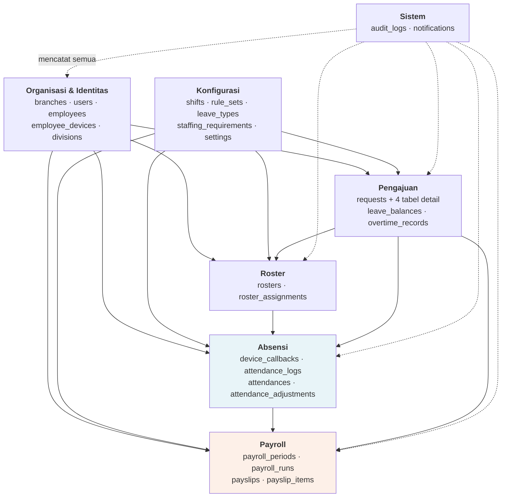
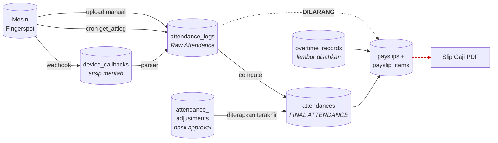
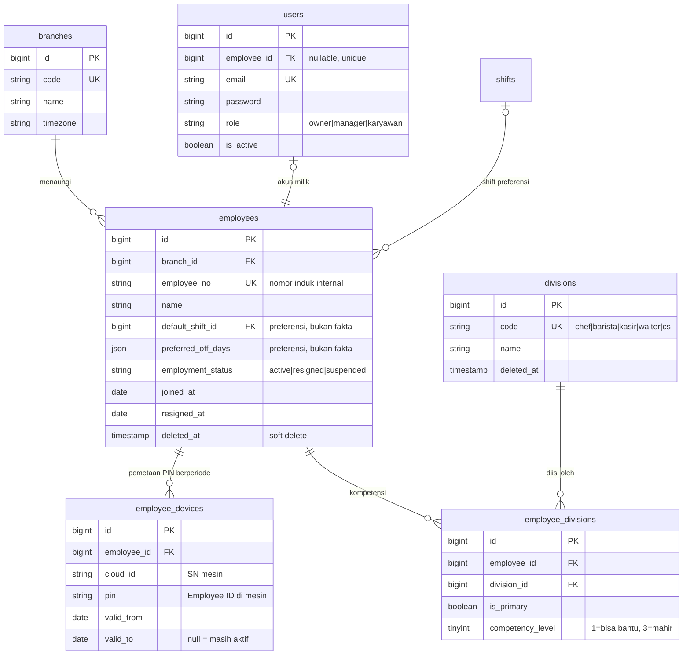
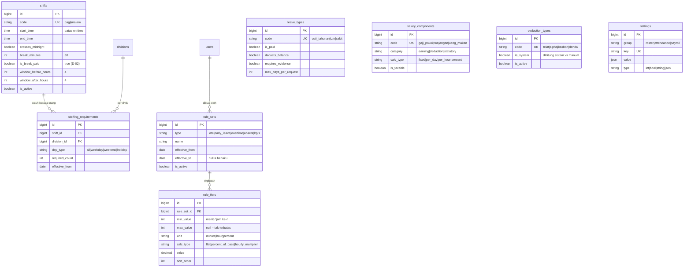
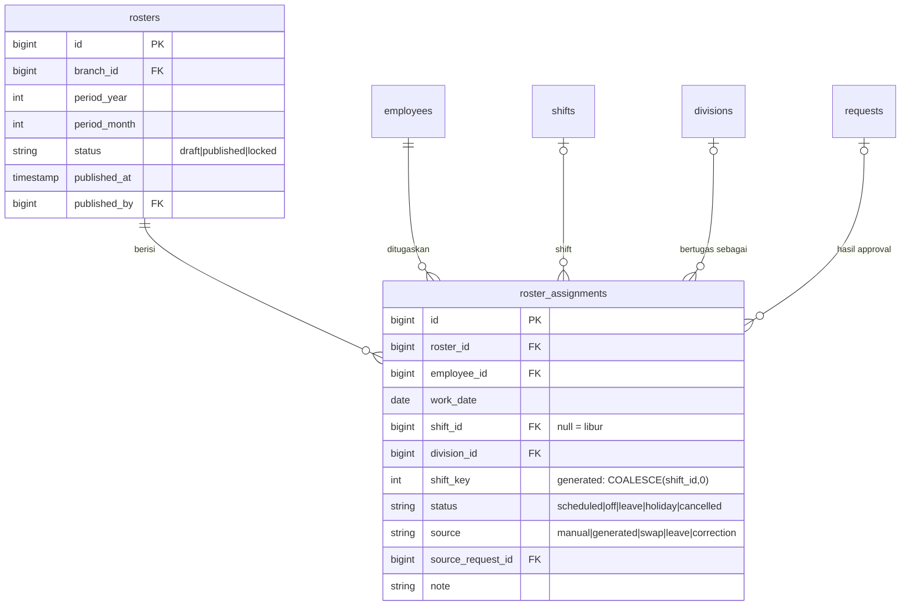
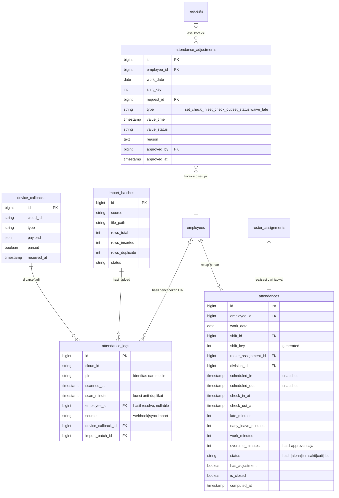
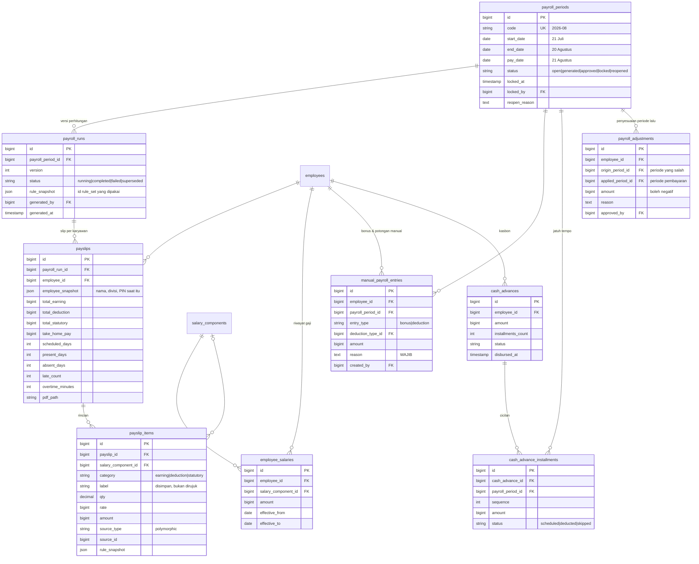
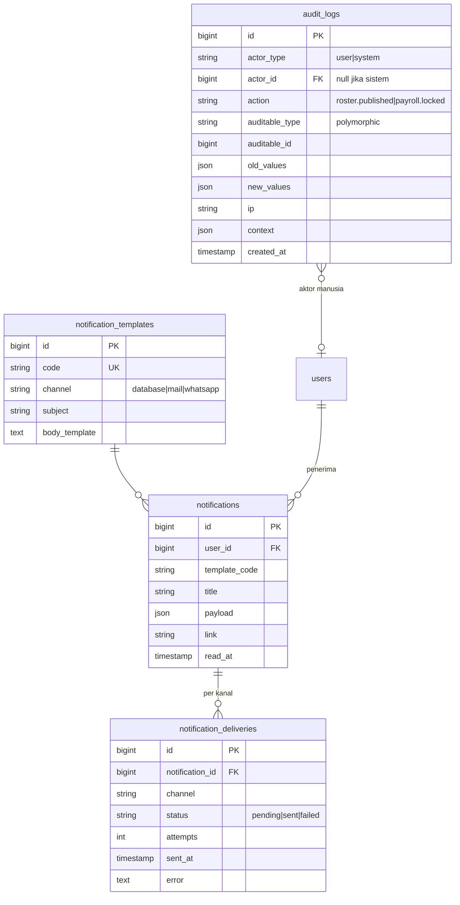

# Tahap 3 — ERD Lengkap

Cafe Workforce Management System
Prasyarat: [Tahap 1](01-analisis-kebutuhan-bisnis.md) · [Tahap 2](02-usulan-perbaikan.md) · [Log Keputusan](00-keputusan.md)

Dokumen ini menetapkan **entitas, kunci, dan relasi**. Tipe kolom lengkap,
indeks, dan constraint dirinci di Tahap 4; daftar relasi Eloquent beserta aturan
cascade di Tahap 5.

---

## 1. Prinsip pemodelan

Enam prinsip ini yang menjelaskan hampir semua keputusan di bawah:

1. **Fakta dan uang dipisah.** Modul absensi tidak pernah menyimpan rupiah.
   Modul payroll tidak pernah menghitung ulang menit.
2. **Data mentah tidak pernah diubah.** `device_callbacks` dan `attendance_logs`
   hanya bertambah. Semua koreksi hidup di tabel lain.
3. **Yang bisa dihitung ulang, boleh dihapus. Yang tidak, tidak pernah dihapus.**
   Ini yang menentukan mana yang pakai soft delete, mana yang pakai status.
4. **Keputusan manusia adalah input, bukan output.** Approval disimpan di tabel
   sendiri lalu diterapkan ulang setiap compute — supaya proses otomatis tidak
   pernah bisa menghapusnya.
5. **Aturan yang menyentuh uang punya masa berlaku dan dibekukan saat dipakai.**
6. **Satu pertanyaan, satu sumber jawaban.** "Hari ini dia shift apa?" hanya
   boleh dijawab `roster_assignments`.

---

## 2. Peta modul dan arah ketergantungan

Arah panah = arah baca. Panah yang tidak ada berarti **dilarang** — dan ini
ditegakkan di struktur folder (Tahap 11), bukan sekadar niat baik.



### Aliran data absensi → payroll (penegakan BR-02)



Garis merah putus-putus adalah larangan BR-02. Ditegakkan secara struktural:
modul Payroll tidak punya repository apa pun ke `attendance_logs`.

---

## 3. ERD per modul

### 3.1 Organisasi & Identitas



**Kenapa `employee_devices` terpisah dari `employees.pin_device`.** Ini
memperbaiki K-08. PIN mesin bukan properti abadi seseorang — ia bisa dipindahkan
ke karyawan lain setelah yang lama resign. Kalau pencocokan scan memakai PIN
"hari ini", seluruh riwayat absensi karyawan lama otomatis berpindah ke orang
baru, diam-diam, tanpa error. Dengan `valid_from`/`valid_to`, pencocokan memakai
pemetaan **yang berlaku pada tanggal scan itu**.

*Trade-off:* satu join di query yang paling sering dipakai. Pada 13.000 baris per
tahun, tidak terasa. `employees.pin_device` yang ada sekarang tetap dipertahankan
sebagai cermin baca-saja (PIN aktif) supaya UI dan command CLI yang sudah ada
tidak perlu diubah semua sekaligus.

**Kenapa `employee_divisions` pivot, bukan `employees.division_id`.** Temuan
kapasitas di Tahap 1: kafe kekurangan 3–4 orang, jadi merangkap divisi pasti
terjadi. Pivot ini yang memungkinkan sistem menjawab *"shift malam tanggal 12
kurang 1 kasir — siapa yang bisa mengisi?"* — pertanyaan yang paling sering
muncul dalam operasional nyata.

**Kenapa `users.employee_id` nullable.** Manager/owner boleh tidak punya data
karyawan (bukan pegawai yang diabsen). Karyawan wajib punya. Unique supaya satu
karyawan tidak bisa punya dua akun.

---

### 3.2 Konfigurasi



**Kenapa `rule_sets` + `rule_tiers` dan bukan kolom di config.** Memperbaiki
K-04. Aturan telat BR-05 jadi 4 baris `rule_tiers` (1–10, 11–30, 31–60, 61–∞)
yang bisa diubah manager dari UI. Aturan **tidak pernah diedit di tempat** —
mengubah tarif berarti membuat `rule_set` baru dengan `effective_from` baru,
yang lama tetap ada sebagai riwayat.

**Kenapa `window_before_hours` pindah ke `shifts`.** Sekarang ada di
`config/attendance.php` sebagai satu nilai global. Shift malam yang berakhir
01:00 wajar punya toleransi berbeda dengan shift pagi. Memindahkannya ke shift
membuat itu mungkin tanpa mengubah kode.

**Kenapa `settings` key-value, bukan kolom-kolom di satu tabel config.**
Nilai-nilai seperti `min_rest_hours`, `max_consecutive_days`,
`overtime_min_minutes` akan terus bertambah. Kolom-per-setting berarti migrasi
setiap kali. *Trade-off:* kehilangan type safety di DB — dikompensasi dengan
kolom `type` + satu service `Settings::get()` yang melakukan casting terpusat.

---

### 3.3 Roster



**Kunci unik: `(employee_id, work_date, shift_key)`.**
`shift_key` adalah *generated column* berisi `COALESCE(shift_id, 0)`. Ini
konsekuensi langsung dari D-04 (double shift diizinkan): kunci
`(employee_id, work_date)` tidak lagi cukup. Kolom bantu ini diperlukan karena
di MySQL nilai NULL tidak pernah bentrok di unique index — tanpa itu, satu
karyawan bisa punya lima baris "libur" di tanggal yang sama tanpa ada yang
mencegah.

**Setiap karyawan punya baris untuk SETIAP hari, termasuk hari libur.**
Alternatifnya (tidak ada baris = libur) lebih hemat, tapi membuat "libur" jadi
sesuatu yang disimpulkan dari ketiadaan data — dan ketiadaan data punya banyak
sebab lain: roster belum dibuat, karyawan baru masuk, baris terhapus. Dengan
baris eksplisit, sistem bisa membedakan *"dia libur"* dari *"belum dijadwalkan"*,
yang mana adalah dua status berbeda dengan konsekuensi berbeda (yang satu wajar,
yang satu perlu dibereskan manager).

*Trade-off:* 18 karyawan × 31 hari = 558 baris per bulan, ±6.700 per tahun.
Tidak ada artinya untuk database mana pun.

**Kenapa `division_id` disalin ke assignment.** Karyawan bisa punya banyak
divisi (3.1). Yang menentukan apakah kebutuhan shift terpenuhi adalah *"dia
bertugas sebagai apa hari itu"*, bukan daftar kompetensinya. Waiter yang
ditugaskan jadi kasir malam itu harus terhitung mengisi kuota kasir.

**Kenapa `rosters` (header) terpisah.** Memberi tempat untuk status
`draft → published`. Karyawan tidak boleh melihat roster draft — jadwal setengah
jadi yang bocor menimbulkan kegaduhan yang tidak perlu.

---

### 3.4 Absensi



**Ini modul dengan perubahan paling sensitif** — tabel-tabelnya sudah berisi data.

**`attendance_adjustments` dikunci ke `(employee_id, work_date, shift_key)`,
bukan ke `attendance_id`.** Disengaja. `attendances` adalah tabel turunan yang
boleh dihapus dan dibangun ulang; kalau koreksi menempel ke `attendance_id`,
recompute akan membuat koreksi jadi yatim. Dengan kunci logis, koreksi tetap
menemukan rumahnya walau baris absensinya dibuat ulang dari nol.

Tabel ini **append-only**. Membatalkan koreksi = menambah baris pembatalan,
bukan menghapus baris lama. Alasannya sama dengan buku kas: yang sudah dicatat
tidak dihapus.

**Urutan pipeline yang harus dipatuhi:**

```
1. ambil scan dalam WorkWindow (dari roster assignment)
2. tentukan check_in / check_out
3. hitung late_minutes, early_leave_minutes, work_minutes
4. tentukan status dari roster + pengajuan yang disetujui
5. TERAPKAN attendance_adjustments   ← selalu terakhir
6. tulis ke attendances
```

Langkah 5 harus paling akhir. Kalau koreksi diterapkan di tengah, perhitungan
telat di langkah 3 memakai jam yang salah.

**`attendance_logs.employee_id` ditambahkan sebagai hasil resolve, bukan sebagai
sumber kebenaran.** Diisi parser dengan menanyakan `employee_devices` yang
berlaku di tanggal scan. Nilainya `null` berarti PIN tidak dikenal — dan itu
justru berguna: satu query `WHERE employee_id IS NULL` langsung memberi daftar
anomali untuk halaman rekonsiliasi (I-17). Kolom ini boleh dihitung ulang kapan
saja; `pin` mentah tetap tidak pernah disentuh.

**Kolom yang DIHAPUS dari `attendances`:** `late_blocks` dan `deduction_amount`.
Keduanya rupiah dan blok potongan — urusan payroll, bukan absensi (D-18).

**`status` kini 6 nilai, bukan 9.** "Terlambat" = `late_minutes > 0`, "Pulang
Cepat" = `early_leave_minutes > 0`, "Lembur" = `overtime_minutes > 0`. Dashboard
tetap menampilkan 9 kartu (I-02).

---

### 3.5 Pengajuan

```mermaid
erDiagram
    requests ||--o| leave_requests : ""
    requests ||--o| overtime_requests : ""
    requests ||--o| shift_swap_requests : ""
    requests ||--o| attendance_corrections : ""
    requests ||--o{ request_attachments : "bukti"
    employees ||--o{ requests : "mengajukan"
    users |o--o{ requests : "diputuskan oleh"
    leave_types ||--o{ leave_requests : ""
    leave_types ||--o{ leave_balances : "saldo"
    employees ||--o{ leave_balances : ""
    leave_balances ||--o{ leave_ledger : "mutasi"
    overtime_requests ||--o{ overtime_records : "realisasi"
    employees ||--o{ overtime_records : ""

    requests {
        bigint id PK
        string code UK "REQ-2026-08-0001"
        string type "leave|overtime|swap|correction"
        bigint employee_id FK "pengaju"
        string status "pending_peer|pending_manager|approved|rejected|cancelled|expired"
        timestamp submitted_at
        bigint decided_by FK
        timestamp decided_at
        text decision_note
        timestamp expires_at
    }
    leave_requests {
        bigint request_id PK_FK
        bigint leave_type_id FK
        date start_date
        date end_date
        decimal total_days
        text reason
    }
    overtime_requests {
        bigint request_id PK_FK
        uuid batch_id "penanda pembuatan massal"
        date work_date
        time planned_start
        time planned_end
        int planned_minutes
        string initiated_by "manager|employee"
        boolean is_backdated
    }
    shift_swap_requests {
        bigint request_id PK_FK
        bigint requester_assignment_id FK
        bigint partner_employee_id FK
        bigint partner_assignment_id FK
        timestamp partner_accepted_at
        timestamp partner_rejected_at
    }
    attendance_corrections {
        bigint request_id PK_FK
        date work_date
        int shift_key
        string correction_type "lupa_masuk|lupa_pulang|mesin_error"
        timestamp proposed_check_in
        timestamp proposed_check_out
        text reason
    }
    leave_balances {
        bigint id PK
        bigint employee_id FK
        bigint leave_type_id FK
        int year
        decimal entitlement_days
        decimal carried_over_days
        decimal used_days
        decimal pending_days
    }
    leave_ledger {
        bigint id PK
        bigint leave_balance_id FK
        bigint request_id FK
        decimal delta_days
        string type "accrual|usage|reversal|carry_over|expiry"
    }
    overtime_records {
        bigint id PK
        bigint employee_id FK
        bigint overtime_request_id FK
        date work_date
        timestamp actual_start
        timestamp actual_end
        int actual_minutes
        int approved_minutes
        int payable_minutes "min(approved, actual)"
        string status "pending_confirmation|confirmed|rejected"
        bigint confirmed_by FK
    }
```

**Pola induk + detail** (I-19). `requests` memegang segala yang sama untuk semua
jenis: kode, status, siapa mengajukan, siapa memutuskan, kapan, catatan, dan
kedaluwarsa. Empat tabel detail memegang yang khas per jenis, dengan
`request_id` sebagai **primary key sekaligus foreign key** (relasi 1:0..1).

Alternatif yang saya tolak: satu tabel dengan kolom JSON. Lebih ringkas ditulis,
tapi `partner_employee_id` di dalam JSON tidak bisa punya foreign key — dan
pengajuan tukar shift yang menunjuk karyawan yang sudah resign akan lolos tanpa
ada yang mencegah.

**Kenapa lembur punya DUA tabel** (I-11). `overtime_requests` adalah *rencana*
(disetujui sebelum kerja, memenuhi BR-13/BR-14). `overtime_records` adalah
*realisasi* (jam sebenarnya dari fingerprint). Yang dibayar
`payable_minutes = min(approved, actual)` secara default. Tanpa pemisahan ini,
lembur yang disetujui 3 jam tapi orangnya pulang setelah 1 jam akan tetap dibayar
3 jam — dan brief tidak menjawab kasus itu.

`batch_id` menangani "manager membuat lembur untuk 3 chef sekaligus": tetap 3
baris request (satu per orang, karena tiap orang punya realisasi dan approval
sendiri), tapi UI bisa mengelompokkannya sebagai satu tindakan.

**`leave_balances.pending_days` terpisah dari `used_days`.** Pengajuan yang belum
diputuskan sudah harus mengurangi saldo yang terlihat, kalau tidak karyawan bisa
mengajukan 12 hari cuti tiga kali sebelum satu pun diputuskan.

**`leave_ledger`** membuat setiap perubahan saldo bisa dijelaskan. Pertanyaan
"kok sisa cuti saya berkurang 2 hari?" harus bisa dijawab dari data.

---

### 3.6 Payroll



**`payroll_runs` sebagai lapisan antara periode dan slip.** Generate ulang tidak
menimpa hasil lama — ia membuat `version` baru dan menandai yang lama
`superseded`. Kalau manager generate, sadar ada yang salah, perbaiki, lalu
generate lagi, riwayat kedua percobaan tetap ada. Tanpa lapisan ini, "generate
ulang" berarti kehilangan bukti.

**`payslip_items.label` dan `rule_snapshot` disimpan, bukan dirujuk.** Ini
sengaja denormalisasi. Slip gaji adalah dokumen yang sudah diterima karyawan —
isinya tidak boleh berubah hanya karena manager mengganti nama komponen gaji atau
menyesuaikan tarif potongan tahun depan. Dokumen keuangan harus membeku begitu
terbit.

**`payslip_items.source_type` + `source_id` polymorphic** menghubungkan setiap
baris uang kembali ke asalnya: potongan telat → baris `attendances`, lembur →
`overtime_records`, kasbon → `cash_advance_installments`. Inilah yang membuat
slip gaji bisa "diklik sampai ke sumbernya" saat karyawan protes — dan sengketa
gaji di kafe hampir selalu tentang *"kenapa dipotong segini"*.

**`manual_payroll_entries` menggabungkan bonus dan potongan manual.** Keduanya
punya siklus hidup identik: dibuat manager, wajib beralasan (BR-23), terikat satu
periode, berakhir sebagai baris di slip. *Alternatif:* dua tabel terpisah, lebih
eksplisit tapi menduplikasi seluruh alur approval dan audit. UI tetap
menampilkannya sebagai dua menu berbeda sesuai brief.

**`payroll_adjustments` menjawab G-11 / I-12.** Koreksi absensi yang datang
setelah periode terkunci tidak membuka kunci apa pun — selisihnya dibayar di
periode berikutnya sebagai baris tersendiri, dengan `origin_period_id` yang
menunjuk periode asal masalahnya. Reopen tetap tersedia, tapi hanya untuk
kesalahan sistemik.

**Semua uang disimpan sebagai integer rupiah** (`bigint`), bukan float. Rupiah
tidak punya sen dalam praktik penggajian kafe, dan float akan menghasilkan selisih
satu rupiah yang mustahil dijelaskan ke karyawan.

---

### 3.7 Sistem



**`audit_logs.actor_type` membedakan manusia dan sistem.** Tanpa ini, log akan
tenggelam oleh perubahan otomatis dari cron compute yang berjalan setiap 15
menit, dan approval cuti yang penting jadi tidak terlihat. Halaman audit default
menyaring `actor_type = 'user'`.

**Pola outbox pada notifikasi** (I-22). `notifications` adalah *apa yang perlu
disampaikan*; `notification_deliveries` adalah *upaya menyampaikannya per kanal*.
Saat WhatsApp ditambahkan nanti, yang bertambah cuma baris di
`notification_deliveries` dan satu driver — tidak ada tabel yang berubah, yang
memenuhi BR-30.

---

## 4. Katalog entitas

| # | Entitas | Jenis | Boleh dihapus? | Modul |
|---|---|---|---|---|
| 1 | branches | Master | Soft delete | Organisasi |
| 2 | users | Master | Soft delete | Organisasi |
| 3 | employees | Master | Soft delete | Organisasi |
| 4 | employee_devices | Master | Soft delete | Organisasi |
| 5 | divisions | Master | Soft delete | Organisasi |
| 6 | employee_divisions | Pivot | Hard delete | Organisasi |
| 7 | shifts | Master | Soft delete | Konfigurasi |
| 8 | staffing_requirements | Master | Hard delete | Konfigurasi |
| 9 | holidays | Master | Hard delete | Konfigurasi |
| 10 | rule_sets | Master berversi | **Tidak pernah** | Konfigurasi |
| 11 | rule_tiers | Master berversi | Ikut rule_set | Konfigurasi |
| 12 | leave_types | Master | Soft delete | Konfigurasi |
| 13 | salary_components | Master | Soft delete | Konfigurasi |
| 14 | deduction_types | Master | Soft delete | Konfigurasi |
| 15 | settings | Master | Hard delete | Konfigurasi |
| 16 | rosters | Transaksi | Status `cancelled` | Roster |
| 17 | roster_assignments | Transaksi | Status `cancelled` | Roster |
| 18 | device_callbacks | **Arsip** | **Tidak pernah** | Absensi |
| 19 | attendance_logs | **Raw** | **Tidak pernah** | Absensi |
| 20 | import_batches | Arsip | Tidak pernah | Absensi |
| 21 | attendances | **Turunan** | Boleh (dibangun ulang) | Absensi |
| 22 | attendance_adjustments | Transaksi append-only | **Tidak pernah** | Absensi |
| 23 | requests | Transaksi | Status `cancelled` | Pengajuan |
| 24 | request_attachments | Transaksi | Hard delete + file | Pengajuan |
| 25 | leave_requests | Detail | Ikut induk | Pengajuan |
| 26 | overtime_requests | Detail | Ikut induk | Pengajuan |
| 27 | shift_swap_requests | Detail | Ikut induk | Pengajuan |
| 28 | attendance_corrections | Detail | Ikut induk | Pengajuan |
| 29 | leave_balances | Transaksi | Tidak pernah | Pengajuan |
| 30 | leave_ledger | Append-only | **Tidak pernah** | Pengajuan |
| 31 | overtime_records | Transaksi | Status `rejected` | Pengajuan |
| 32 | payroll_periods | Transaksi | **Tidak pernah** | Payroll |
| 33 | payroll_runs | Transaksi | Status `superseded` | Payroll |
| 34 | payslips | **Dokumen** | **Tidak pernah** | Payroll |
| 35 | payslip_items | Dokumen | **Tidak pernah** | Payroll |
| 36 | employee_salaries | Master berversi | Tidak pernah | Payroll |
| 37 | manual_payroll_entries | Transaksi | Sebelum generate saja | Payroll |
| 38 | cash_advances | Transaksi | Status | Payroll |
| 39 | cash_advance_installments | Transaksi | Status | Payroll |
| 40 | payroll_adjustments | Transaksi | Tidak pernah | Payroll |
| 41 | audit_logs | **Append-only** | **Tidak pernah** | Sistem |
| 42 | notification_templates | Master | Soft delete | Sistem |
| 43 | notifications | Transaksi | Arsip > 1 tahun | Sistem |
| 44 | notification_deliveries | Transaksi | Ikut notifikasi | Sistem |

**44 tabel** (di luar 3 tabel bawaan framework: cache, jobs, sessions). Terdengar
banyak untuk 18 karyawan — tapi 11 di antaranya adalah master data yang isinya
belasan baris dan tidak pernah berubah, dan 9 adalah tabel detail yang menempel
1:1 ke induknya. Kompleksitas nyatanya ada di 6 tabel: `roster_assignments`,
`attendance_logs`, `attendances`, `requests`, `payslips`, `payslip_items`.

Ini menjawab I-21 sekaligus: soft delete **tidak** diterapkan menyeluruh. Master
data pakai soft delete karena masih dirujuk data historis. Transaksi tidak pernah
dihapus, hanya berubah status. Turunan boleh dihapus karena bisa dibangun ulang.

---

## 5. Aturan integritas yang tidak bisa diwakili foreign key

Ini yang wajib ditegakkan di service layer (Tahap 12), didaftar sekarang supaya
tidak terlupa dan supaya bisa langsung jadi daftar test case:

| # | Invariant | Tempat penegakan |
|---|---|---|
| INV-01 | Payroll tidak boleh menyentuh `attendance_logs` | Struktur modul + test arsitektur |
| INV-02 | Periode `locked` menolak semua penulisan ke absensi, roster, pengajuan di rentangnya | Guard terpusat `PayrollLockGuard` |
| INV-03 | `attendances` tidak boleh ada tanpa `roster_assignment` atau scan | Compute service |
| INV-04 | `overtime_records.payable_minutes` ≤ `approved_minutes`, kecuali disetujui manual dengan alasan | Overtime service |
| INV-05 | `leave_balances.used_days + pending_days` ≤ entitlement + carry over | Leave service |
| INV-06 | Tukar shift hanya antar karyawan dengan kompetensi divisi yang sama | Swap validator |
| INV-07 | Satu karyawan tidak boleh punya dua assignment dengan jam yang bertabrakan | Roster validator (Error) |
| INV-08 | `employee_devices` tidak boleh punya periode tumpang tindih untuk `(cloud_id, pin)` yang sama | Device service |
| INV-09 | `rule_sets` dengan `type` sama tidak boleh tumpang tindih masa berlakunya | Rule service |
| INV-10 | Slip gaji yang sudah `published` tidak boleh berubah nilainya | Model guard + audit |
| INV-11 | Approval hanya oleh `manager`/`owner`, dan tidak boleh menyetujui pengajuan sendiri | Policy |
| INV-12 | Karyawan hanya bisa membaca datanya sendiri | Policy per baris |

---

## 6. Keterlacakan terhadap aturan bisnis

Bukti bahwa ERD ini menutup seluruh BR di Tahap 1:

| BR | Ditangani oleh |
|---|---|
| BR-01 identitas dari mesin | `employee_devices` (PIN berperiode) |
| BR-02 payroll ≠ raw | Peta modul §2 + INV-01 |
| BR-03 tidak baca mesin realtime | `attendance_logs` (tidak berubah) |
| BR-04 toleransi 0 | `rule_sets` type `late`, tier pertama mulai menit 1 |
| BR-05 potongan bertingkat | `rule_tiers` |
| BR-06 pulang cepat | `attendances.early_leave_minutes` + rule `early_leave` |
| BR-07 istirahat tanpa scan | `shifts.break_minutes`, `is_break_paid` (D-02) |
| BR-08 roster bulanan | `rosters.period_year/month` |
| BR-09 dibuat tgl 20–25 | Status `draft` + pengingat terjadwal |
| BR-10 bisa diedit sebelum lock | INV-02 |
| BR-11/12 kebutuhan per shift | `staffing_requirements` |
| BR-13/14 lembur wajib approval | `overtime_requests` → `overtime_records` |
| BR-15 minimal lembur | `settings.overtime_min_minutes` |
| BR-16 tarif lembur | `rule_sets` type `overtime` |
| BR-17 satu modul pengajuan | `requests` + 4 detail |
| BR-18 koreksi + bukti + audit | `attendance_corrections`, `request_attachments`, `audit_logs` |
| BR-19 tukar shift 2 approval | `shift_swap_requests.partner_accepted_at` + `requests.decided_by` |
| BR-20 cuti ubah roster | `roster_assignments.source = 'leave'` |
| BR-21 gaji tanggal 21 | `payroll_periods.pay_date` (D-01) |
| BR-22 formula THP | `payslip_items.category` |
| BR-23 bonus wajib alasan | `manual_payroll_entries.reason` NOT NULL |
| BR-24 jenis potongan | `deduction_types` |
| BR-25 BPJS configurable | `rule_sets` type `bpjs` |
| BR-26 payroll lock | `payroll_periods.status` + INV-02 |
| BR-27 slip + PDF | `payslips.pdf_path` |
| BR-28 dua role | `users.role` (D-12) |
| BR-29 audit log | `audit_logs` polymorphic |
| BR-30 siap notifikasi | `notifications` + `notification_deliveries` |

Seluruh 30 aturan bisnis punya rumah. Tidak ada BR yang menggantung, dan tidak
ada tabel yang tidak melayani BR mana pun.

---

## 7. Status konflik Tahap 1

| Konflik | Status |
|---|---|
| K-01 shift statis vs roster | ✅ `employees.default_shift_id` jadi preferensi |
| K-02 off_days vs roster | ✅ `preferred_off_days`, roster jadi otoritas |
| K-03 recompute menghapus koreksi | ✅ `attendance_adjustments` sebagai input |
| K-04 rule di config | ✅ `rule_sets` + `rule_tiers` |
| K-05 rupiah di absensi | ✅ Kolom dihapus, pindah ke `payslip_items` |
| K-06 role | ✅ D-12 |
| K-07 9 status | ✅ Tiga dimensi (§3.4) |
| K-08 PIN tanpa periode | ✅ `employee_devices` |
| K-09 import manual | ✅ `import_batches`, jalur ketiga |
| K-10 unique employee+date | ✅ `shift_key` (D-04) |
| K-11 soft delete menyeluruh | ✅ Selektif (§4) |
| K-12 audit log | ✅ `audit_logs` |

**Semua konflik tertutup. Tidak ada yang tersisa.** Satu hal masih menunggu
konfirmasi — tipe mesin (D-13) — tapi tidak memengaruhi ERD sama sekali.

---

## 8. Yang perlu dikonfirmasi sebelum Tahap 4

Tidak ada yang memblokir. Tiga hal berikut cukup dikoreksi kalau salah, tanpa
mengubah bentuk ERD:

1. **Divisi Cleaning Service** belum punya angka kebutuhan minimum
   (`staffing_requirements`). Sementara saya isi 1 pagi / 1 malam.
2. **Nomor induk karyawan** (`employees.employee_no`) — apakah kafe sudah punya
   penomoran sendiri, atau digenerate sistem?
3. **Tipe mesin** (D-13) — Revo W-231N atau Vivo W-2421M?
