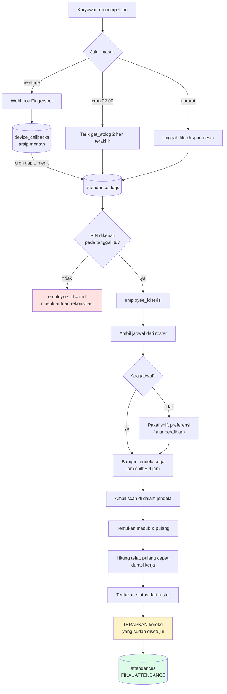
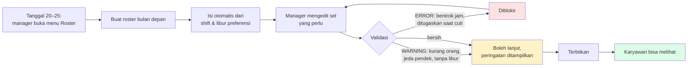
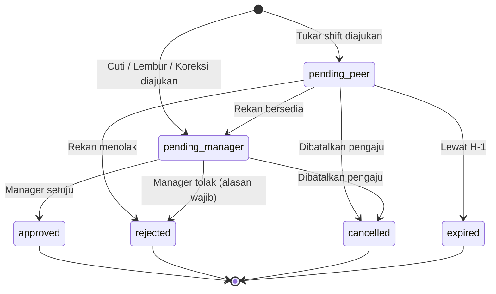
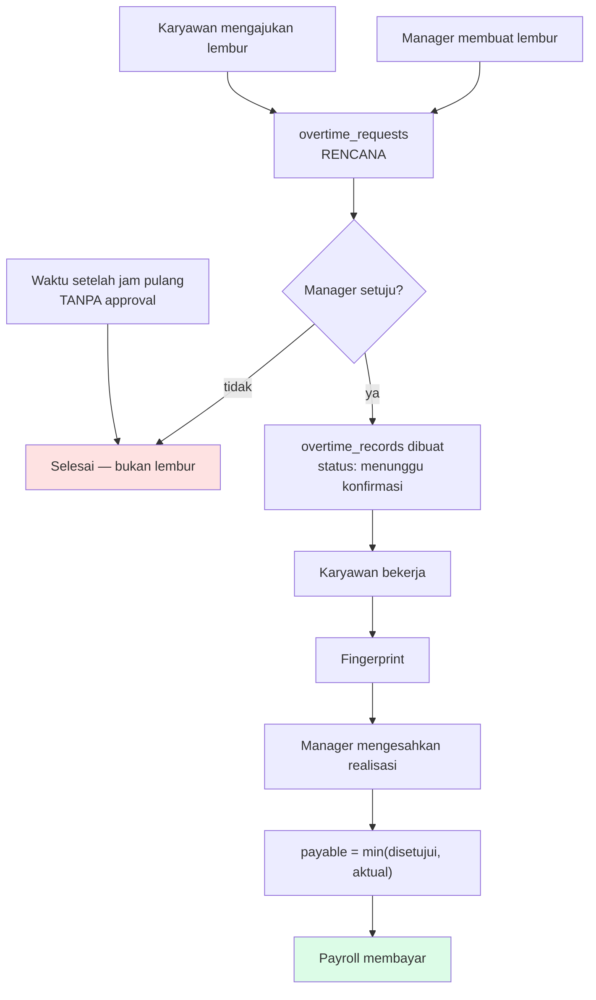
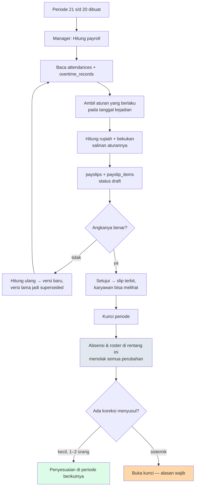

# Tahap 5 & 6 — Relasi Lengkap dan Flowchart Proses

Cafe Workforce Management System
Prasyarat: [Tahap 3 — ERD](03-erd.md) · [Tahap 4 — Struktur Database](04-struktur-database.md)

---

# TAHAP 5 — Relasi

## 5.1 Matriks relasi

Kolom "Cascade" adalah yang terjadi saat induk dihapus.

| Induk | Anak | Tipe | Cascade | Alasan |
|---|---|---|---|---|
| branches | employees | 1:N | `nullOnDelete` | Karyawan tidak boleh ikut hilang kalau cabang dihapus |
| employees | users | 1:0..1 | `nullOnDelete` | Akun boleh ada tanpa karyawan (manager) |
| employees | employee_devices | 1:N | `cascade` | Pemetaan PIN tidak punya makna tanpa orangnya |
| employees | employee_divisions | N:M | `cascade` | Pivot murni |
| divisions | employee_divisions | N:M | `cascade` | Pivot murni |
| employees | roster_assignments | 1:N | `cascade` | — |
| rosters | roster_assignments | 1:N | `cascade` | Hapus roster = hapus seluruh isinya |
| shifts | roster_assignments | 1:N | `nullOnDelete` | Shift dihapus tidak boleh menghapus jadwal historis |
| employees | attendances | 1:N | `cascade` | — |
| roster_assignments | attendances | 1:0..1 | `nullOnDelete` | **Penting**: absensi tetap ada walau jadwalnya dihapus |
| attendance_logs | attendances | 1:N (first/last) | `nullOnDelete` | Jejak ke scan asal boleh putus, rekapnya tidak |
| device_callbacks | attendance_logs | 1:N | `nullOnDelete` | Arsip mentah tidak pernah dihapus, tapi jaga-jaga |
| employees | attendance_adjustments | 1:N | `cascade` | — |
| requests | leave_requests | 1:0..1 | `cascade` | Detail tanpa induk = data yatim |
| requests | overtime_requests | 1:0..1 | `cascade` | idem |
| requests | shift_swap_requests | 1:0..1 | `cascade` | idem |
| requests | attendance_corrections | 1:0..1 | `cascade` | idem |
| requests | request_attachments | 1:N | `cascade` | — |
| requests | roster_assignments | 1:N (source) | `nullOnDelete` | Jadwal hasil approval tetap berlaku walau pengajuannya hilang |
| overtime_requests | overtime_records | 1:N | `nullOnDelete` | Realisasi yang sudah dibayar tidak boleh lenyap |
| leave_types | leave_balances | 1:N | `cascade` | — |
| leave_balances | leave_ledger | 1:N | `cascade` | — |
| payroll_periods | payroll_runs | 1:N | `cascade` | — |
| payroll_runs | payslips | 1:N | `cascade` | — |
| payslips | payslip_items | 1:N | `cascade` | Rincian tidak punya arti tanpa slipnya |
| employees | employee_salaries | 1:N | `cascade` | — |
| rule_sets | rule_tiers | 1:N | `cascade` | Tier tanpa rule set tidak bisa dibaca |
| notifications | notification_deliveries | 1:N | `cascade` | — |

## 5.2 Dua relasi yang sengaja BUKAN foreign key

**`attendance_adjustments` → `attendances`.** Koreksi dikunci ke
`(employee_id, work_date, shift_key)`, bukan ke `attendance_id`. Kalau memakai
foreign key, recompute yang menghapus-dan-membuat-ulang baris absensi akan
membuat setiap koreksi jadi yatim. Dengan kunci logis, koreksi selalu menemukan
rumahnya lagi.

**`payslip_items` → sumbernya.** Kolom `source_type` + `source_id` bersifat
polymorphic ke lima tabel berbeda (`attendances`, `overtime_records`,
`cash_advance_installments`, `manual_payroll_entries`, `payroll_adjustments`).
Tidak ada FK karena satu kolom tidak bisa menunjuk lima tabel. Konsekuensinya
integritas dijaga aplikasi — dan itu diterima, karena baris slip **tidak pernah
dihapus**, jadi tidak ada risiko menunjuk ke sesuatu yang hilang.

## 5.3 Relasi Eloquent per model

```
Branch          hasMany: employees, settings, payrollPeriods
Employee        belongsTo: branch, defaultShift
                hasOne:   user
                hasMany:  devices, rosterAssignments, attendances, requests,
                          leaveBalances, salaries, payslips, overtimeRecords,
                          attendanceLogs
                belongsToMany: divisions (pivot: is_primary, competency_level)
User            belongsTo: employee          hasMany: notifications
Shift           hasMany: employees (default), assignments, attendances
Division        belongsToMany: employees     hasMany: staffingRequirements

Roster          hasMany: assignments         belongsTo: publisher
RosterAssignment belongsTo: roster, employee, shift, division

AttendanceLog   belongsTo: employee, deviceCallback, importBatch
Attendance      belongsTo: employee, shift, division, rosterAssignment
                hasMany:  overtimeRecords
AttendanceAdjustment belongsTo: employee, approver, request

Request         belongsTo: employee, decider
                hasOne:   leave, overtime, swap, correction
                hasMany:  attachments
LeaveBalance    belongsTo: employee, leaveType   hasMany: ledger
OvertimeRecord  belongsTo: employee, overtimeRequest

PayrollPeriod   hasMany: runs, manualEntries
PayrollRun      belongsTo: period               hasMany: payslips
Payslip         belongsTo: run, employee        hasMany: items
                                                (+ earnings/deductions/statutories)
RuleSet         hasMany: tiers                  belongsTo: creator
```

## 5.4 Scope yang menegakkan aturan bisnis

Beberapa aturan penting hidup sebagai query scope, bukan sebagai `if` yang
tersebar. Ini yang membuatnya sulit dilupakan:

| Scope | Menegakkan |
|---|---|
| `Roster::visibleToEmployee()` | Karyawan tidak pernah melihat roster draft |
| `RosterAssignment::working()` | "Bertugas" ≠ "punya baris" — libur juga punya baris |
| `EmployeeDevice::activeOn($date)` | Pemetaan PIN dibaca per tanggal, bukan per hari ini |
| `RuleSet::effectiveOn($date)` | Tarif dibaca per tanggal kejadian |
| `EmployeeSalary::effectiveOn($date)` | Gaji dibaca per tanggal, bukan gaji sekarang |
| `AttendanceAdjustment::effectiveFor()` | Koreksi yang dibatalkan tidak ikut diterapkan |
| `AuditLog::byHuman()` | Log manusia tidak tenggelam oleh log cron |
| `Payslip::published()` | Slip draft tidak bocor ke karyawan |
| `AttendanceLog::unresolved()` | Antrian rekonsiliasi PIN tak dikenal |

---

# TAHAP 6 — Flowchart Proses

## 6.1 Absensi: dari jari ke Final Attendance



Kotak kuning adalah langkah yang **wajib paling akhir**. Kalau koreksi
diterapkan sebelum langkah hitung, perhitungan telat memakai jam yang salah.

## 6.2 Roster bulanan



## 6.3 Pengajuan — satu mesin state, empat jenis



Efek setelah `approved`, berbeda per jenis:

| Jenis | Efek |
|---|---|
| Cuti | Roster jadi `leave` + saldo pending → terpakai + adjustment status absensi |
| Lembur | Dibuat `overtime_records` berstatus **menunggu konfirmasi realisasi** |
| Tukar shift | Pemilik kedua `roster_assignments` ditukar |
| Koreksi | Dibuat baris `attendance_adjustments` (bukan menulis ke `attendances`) |

## 6.4 Lembur — dua titik approval



## 6.5 Payroll



## 6.6 Proses terjadwal

| Jam | Proses | Kenapa jamnya begitu |
|---|---|---|
| tiap menit | Kuras antrian callback → `attendance_logs` | Dashboard harus segar |
| tiap 15 menit | Hitung ulang 2 hari terakhir | Kemarin ikut karena scan pulang shift malam baru lengkap lewat tengah malam |
| 02:00 | Tarik ulang `get_attlog` 2 hari | Shift malam sudah benar-benar bubar (pulang 01:00) |
| 06:00 | Tutup hari kemarin, tetapkan alpha | Jendela shift malam baru tutup 05:00 |
| tanggal 20 | Ingatkan manager: roster bulan depan | Sesuai kebiasaan yang sudah berjalan |
| tanggal 21 | Buat periode payroll baru | Hari pembayaran |
