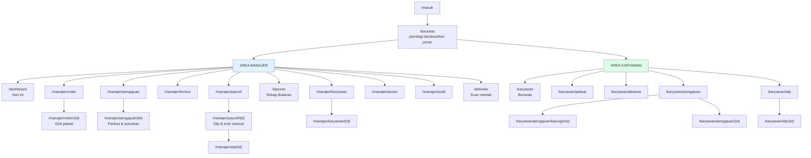

# Tahap 7, 8 & 9 — Sitemap, Daftar Halaman, Wireframe

Cafe Workforce Management System

---

# TAHAP 7 — Sitemap



Pemisahan `/manajer` dan `/karyawan` bukan kosmetik — itu lapis pertama RBAC di
level rute. Lapis kedua adalah otorisasi per baris: `/karyawan/slip/123` milik
orang lain menghasilkan 403, bukan sekadar tidak muncul di menu.

---

# TAHAP 8 — Daftar Halaman

## Area Manajer

| # | Halaman | Rute | Fungsi utama |
|---|---|---|---|
| 1 | Dashboard | `/dashboard` | 9 metrik hari ini, roster hari ini, pengajuan pending, absensi, scan mentah |
| 2 | Daftar Roster | `/manajer/roster` | Daftar periode + tombol buat bulan depan |
| 3 | Grid Roster | `/manajer/roster/{id}` | Grid 18×31, isi otomatis, edit sel, validasi, terbitkan |
| 4 | Inbox Pengajuan | `/manajer/pengajuan` | Daftar tersaring status & jenis |
| 5 | Periksa Pengajuan | `/manajer/pengajuan/{id}` | Rincian per jenis + setujui/tolak |
| 6 | Lembur | `/manajer/lembur` | Tugaskan massal + sahkan realisasi |
| 7 | Daftar Payroll | `/manajer/payroll` | Periode & statusnya |
| 8 | Detail Payroll | `/manajer/payroll/{id}` | Hitung, setujui, kunci, bonus/potongan manual, daftar slip |
| 9 | Slip (manajer) | `/manajer/slip/{id}` | Slip lengkap, bisa dicetak |
| 10 | Rekap Bulanan | `/laporan` | Rekap absensi + unduh Excel |
| 11 | Karyawan | `/manajer/karyawan` | Daftar + divisi + PIN aktif |
| 12 | Detail Karyawan | `/manajer/karyawan/{id}` | Data, riwayat PIN, kompetensi divisi |
| 13 | Aturan | `/manajer/aturan` | Tarif potongan/lembur/BPJS + setelan operasional |
| 14 | Audit | `/manajer/audit` | Jejak tindakan, default hanya manusia |
| 15 | Aktivitas Scan | `/aktivitas` | Scan mentah, penelusuran sengketa |

## Area Karyawan

| # | Halaman | Rute | Fungsi utama |
|---|---|---|---|
| 16 | Beranda | `/karyawan` | Jadwal hari ini, absensi hari ini, saldo cuti, aksi cepat |
| 17 | Jadwal Saya | `/karyawan/jadwal` | Kalender bulanan |
| 18 | Absensi Saya | `/karyawan/absensi` | Riwayat + ringkasan bulan |
| 19 | Pengajuan Saya | `/karyawan/pengajuan` | Daftar + yang menunggu jawaban saya |
| 20 | Form Pengajuan | `/karyawan/pengajuan/baru/{jenis}` | Empat bentuk formulir |
| 21 | Detail Pengajuan | `/karyawan/pengajuan/{id}` | Status, batalkan, jawab tukar shift |
| 22 | Slip Gaji Saya | `/karyawan/slip` | Daftar slip terbit |
| 23 | Slip Gaji | `/karyawan/slip/{id}` | Rincian + cetak PDF |

## Bersama

| # | Halaman | Rute |
|---|---|---|
| 24 | Masuk | `/masuk` |

**24 halaman.** Tidak ada halaman "pengaturan sistem" terpisah — setelan
operasional digabung ke halaman Aturan, karena keduanya sama-sama "angka yang
boleh diubah manager" dan memisahkannya cuma menambah tempat untuk dicari.

---

# TAHAP 9 — Wireframe

Notasi: `[...]` tombol, `(...)` input, `|` pemisah kolom.

## 9.1 Dashboard Manajer

```
┌──────────────────────────────────────────────────────────────────────┐
│ Absensi Kafe │ Hari Ini · Roster · Pengajuan⁽²⁾ · Lembur · Payroll   │
│              │ Rekap · Karyawan · Aturan · Audit    Manajer [Keluar] │
├──────────────────────────────────────────────────────────────────────┤
│ Dashboard                                    Tanggal (06/08/2026)[Lihat]
│ Kamis, 06 Agustus 2026                                               │
│                                                                      │
│ ┌────────┬────────┬──────────┬────────┬────────┐                     │
│ │ HADIR  │TERLAMBAT│PLG CEPAT │ ALPHA  │ LEMBUR │  ← 5 kartu         │
│ │   6    │    4    │    0     │   0    │   0    │                     │
│ ├────────┼────────┼──────────┼────────┼────────┤                     │
│ │  IZIN  │ SAKIT  │  CUTI    │ LIBUR  │KARYAWAN│  ← 5 kartu          │
│ │   0    │   0    │    0     │   0    │   18   │                     │
│ └────────┴────────┴──────────┴────────┴────────┘                     │
│                                                                      │
│ ┌──────────────────────────────────┬─────────────────────────────┐   │
│ │ Roster Hari Ini                  │ Pengajuan Pending      ⁽²⁾  │   │
│ │ Shift Pagi 09:00–17:00  7 orang  │ ● Indra M — Koreksi         │   │
│ │  ●Andi(Chef) ●Budi(Chef) ●Gita.. │   REQ-2026-08-0002          │   │
│ │ Shift Malam 17:00–01:00 9 orang  │ ● Hana S — Cuti             │   │
│ │  ●Cahyo(Chef) ●Dedi(Chef) ...    │   [Lihat semua]             │   │
│ └──────────────────────────────────┴─────────────────────────────┘   │
│                                                                      │
│ Absensi Hari Ini                                                     │
│ Nama │Shift│Jadwal│Masuk│Pulang│Telat│PlgCpt│Lembur│Status           │
│ ─────┼─────┼──────┼─────┼──────┼─────┼──────┼──────┼──────           │
│ Andi │Pagi │09:00 │09:00│17:02 │  —  │  —   │  —   │[Hadir]          │
│ Budi │Pagi │09:00 │09:03│17:02 │ 3 m │  —   │  —   │[Hadir]          │
│                                                                      │
│ Aktivitas Scan                                                       │
│ Waktu │PIN│Nama│Sumber│Foto                                          │
└──────────────────────────────────────────────────────────────────────┘
```

**Kenapa 9 kartu, bukan 6.** Brief meminta 9 angka. Tiga di antaranya
(Terlambat, Pulang Cepat, Lembur) bukan status tersimpan melainkan hitungan
kolom menit — itu sebabnya Hadir 6 dan Terlambat 4 bisa muncul bersamaan
untuk 6 orang yang sama. Ini bukan salah hitung; empat dari enam yang hadir
memang datang terlambat.

## 9.2 Grid Roster

```
┌──────────────────────────────────────────────────────────────────────┐
│ Roster Agustus 2026  [Terbit]   18 karyawan · 31 hari                │
│                                       [Isi otomatis] [Terbitkan]     │
│                                                                      │
│ ▸ 86 peringatan — roster tetap bisa diterbitkan       ← bisa dibuka  │
│                                                                      │
│ Karyawan       │ 1  2  3  4  5  6  7  8  9 10 11 ... 31              │
│                │Sab Min Sen Sel Rab Kam Jum Sab Min                  │
│ ───────────────┼──────────────────────────────────────               │
│ Andi Pratama   │ P  ·  P  P  P  P  P  P  ·  P  P                     │
│ Chef           │                                                      │
│ Cahyo Nugroho  │ M  M  M  ·  M  M  M  M  M  M  ·                     │
│ Chef           │                                                      │
│                                                                      │
│ ▪P = Shift Pagi  ▪M = Shift Malam  · = libur  C = cuti               │
│                                                                      │
│ Ubah Jadwal                                                          │
│ (Karyawan▾) (Tanggal) (Shift▾) (Bertugas sebagai▾) [Simpan]          │
└──────────────────────────────────────────────────────────────────────┘
```

**Peringatan sengaja dilipat, bukan disembunyikan.** Dengan 18 orang, 86
peringatan adalah kondisi normal — kalau ditampilkan terbuka, halaman jadi
tembok merah yang langsung diabaikan. Dilipat dengan angkanya terlihat: manager
tahu ada, dan bisa membukanya saat perlu.

## 9.3 Periksa Pengajuan

```
┌─────────────────────────────────────────────────────┐
│ ← Kembali                                           │
│ ┌─────────────────────────────────────────────────┐ │
│ │ Cuti / Izin / Sakit        [Menunggu Manager]   │ │
│ │ REQ-2026-08-0001 · Hana Safitri · 06 Agu 14:20  │ │
│ ├─────────────────────────────────────────────────┤ │
│ │ Jenis        Cuti Tahunan                       │ │
│ │ Tanggal      16 Agu 2026 – 17 Agu 2026          │ │
│ │ Jumlah       2 hari                             │ │
│ │ Alasan       Menghadiri pernikahan saudara      │ │
│ ├─────────────────────────────────────────────────┤ │
│ │ [Setujui]  (Alasan penolakan (wajib)...) [Tolak]│ │
│ └─────────────────────────────────────────────────┘ │
└─────────────────────────────────────────────────────┘
```

Kolom alasan penolakan **wajib** dan menempel langsung di tombol Tolak. Menolak
tanpa penjelasan adalah cara tercepat membuat orang berhenti memakai sistem dan
kembali bertanya lewat WhatsApp.

## 9.4 Slip Gaji

```
┌──────────────────────────────────────────────────────┐
│ ← Kembali                        [Cetak / Simpan PDF]│
│ ┌──────────────────────────────────────────────────┐ │
│ │ Slip Gaji            SLIP-2026-08-003            │ │
│ │ Absensi Kafe         Periode 21 Jul – 20 Agu 2026│ │
│ │                      Dibayar 21 Agu 2026         │ │
│ ├──────────────────────────────────────────────────┤ │
│ │ Nama    Cahyo Nugroho  │ No. Induk  EMP-012      │ │
│ │ Divisi  Chef           │ PIN mesin  102          │ │
│ ├──────────────────────────────────────────────────┤ │
│ │ Hari kerja │Hadir│Alpha│Cuti│Telat│Lembur        │ │
│ │     17     │  16 │  1  │ 0  │ 3x  │ 1.0 j        │ │
│ ├──────────────────────────────────────────────────┤ │
│ │ PENDAPATAN                                       │ │
│ │  Gaji Pokok                        4.800.000     │ │
│ │  Lembur 1 jam                         52.941     │ │
│ │  Subtotal                          4.852.941     │ │
│ │ POTONGAN                                         │ │
│ │  Potongan Terlambat (3x)              25.000     │ │
│ │  Potongan Alpha (1 hari)             282.352     │ │
│ │  Subtotal                            307.352     │ │
│ │ BPJS & POTONGAN WAJIB                            │ │
│ │  BPJS Kesehatan (1%)                  48.000     │ │
│ │  BPJS JHT (2%)                        96.000     │ │
│ │  BPJS Jaminan Pensiun (1%)            48.000     │ │
│ │  Subtotal                            192.000     │ │
│ ├──────────────────────────────────────────────────┤ │
│ │ ████ Take Home Pay        Rp 4.353.589 ████      │ │
│ └──────────────────────────────────────────────────┘ │
│ Angka di slip ini dibekukan saat payroll dihitung.   │
└──────────────────────────────────────────────────────┘
```

Setiap baris potongan menyebut jumlah kejadiannya ("3x", "1 hari"), bukan cuma
nominal. Sengketa gaji di kafe hampir selalu tentang *"kenapa dipotong segini"* —
dan pertanyaan itu terjawab lebih cepat oleh angka kejadian daripada oleh rupiah.

## 9.5 Beranda Karyawan

```
┌──────────────────────────────────────────────────────────────┐
│ Halo, Gita Lestari                                           │
│ Barista · Kamis, 06 Agustus 2026                             │
│                                                              │
│ ⚠ Ada yang menunggu jawaban Anda                             │
│   Budi ingin menukar shift 12 Agu (Shift Pagi)     [Jawab]   │
│                                                              │
│ ┌────────────────────────────────┬─────────────────────────┐ │
│ │ Hari Ini                       │ Ajukan                  │ │
│ │ [Shift Pagi] 09:00–17:00       │ [Cuti/Izin] [Lembur]    │ │
│ │ sebagai Barista                │ [Tukar Shift] [Koreksi] │ │
│ │ Masuk 09:00 · Pulang 17:02     ├─────────────────────────┤ │
│ │ [Hadir]                        │ Saldo Cuti              │ │
│ ├────────────────────────────────┤ Cuti Tahunan     10 hari│ │
│ │ Jadwal Berikutnya  [Sebulan]   ├─────────────────────────┤ │
│ │ Jumat, 07 Agu    [Shift Pagi]  │ Pengajuan Berjalan      │ │
│ │ Sabtu, 08 Agu    [Shift Pagi]  │ Cuti  [Menunggu Manager]│ │
│ │ Minggu, 09 Agu   libur         ├─────────────────────────┤ │
│ └────────────────────────────────┤ Slip terbaru            │ │
│                                  │ Rp 3.612.400            │ │
│                                  └─────────────────────────┘ │
└──────────────────────────────────────────────────────────────┘
```

Empat tombol pengajuan ditaruh di beranda, bukan disembunyikan di menu. Itu
alasan utama karyawan membuka aplikasi ini sama sekali — kalau butuh tiga klik,
mereka akan tetap mengirim WhatsApp ke manager.

## 9.6 Prinsip tampilan yang dipakai konsisten

1. **Angka besar dulu, tabel belakangan.** Manager membuka dashboard untuk tahu
   "ada masalah tidak?", bukan untuk membaca 18 baris.
2. **Peringatan dilipat dengan jumlahnya terlihat.** Terbuka semua = diabaikan.
3. **Alasan wajib menempel pada tombolnya**, bukan di dialog terpisah.
4. **Warna divisi konsisten** di grid roster, dashboard, dan daftar karyawan.
5. **Tidak ada rupiah di halaman absensi.** Uang hanya muncul di payroll dan
   slip — batas ini terlihat pengguna, bukan cuma ada di struktur database.
6. **Tabel lebar menggulir di dalam kotaknya sendiri**, halaman tidak pernah
   menggulir mendatar.
